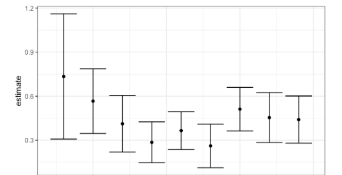

```{r setup, include=FALSE}
knitr::opts_chunk$set(echo = TRUE)
```

```{r}
rm(list=ls())
library(foreign)
library(ggplot2)
library(tidyverse)
library(haven)
library(MASS)

library(dplyr)
library(ISLR)
library(glmnet)
library(arm)
library(coefplot)
```

**NAME: Your Name **  
**DUE DATE: March 9th, 11:59pm** 

## Problem 1 (100 pts)

In the folder Assignment 3, you will find the data set called FF_wave6_2020v2.dta. This data set is from the Fragile Family Data Set, and it includes many different variables (socio-demographic, economics, and health status) of teenagers (15 years old) and their parents.
The codebook (ff_wave6_codebook.txt) associated with the data set is on Canvas (folder Assignment 3).


  (a) (20 points)  Consider the variable _doctor diagnosed youth with depression/anxiety_. In the data set, the name of this variable is _p6b5_. Then consider in the data set these variables: _p6b10_, _p6b35_, _p6b55_, _p6b60_, _p6c21_, _p6f32_, _p6f35_, _p6h74_, _p6h102_, _p6i7_, _p6i8_, _p6i11_, _p6j37_, _k6b21a_, _k6b22a_, _k6c1_, _k6c4e_, _k6c28_, _k6d37_, _k6f63_, _ck6cbmi_, _k6d10_. Now, you have a data set with 4898 subjects and 23 variables. Clean the data in these three steps. 1- Each variable has a value with a number and a text (for example, a value for the variable _p6b5_ is _2 No_). Remove the text from all the variables in the data set (hint: use the function sub for each column). 2- Transform each variable in numeric (hint: use the function as.numeric for each column). 3- Transform all the values less than 0 in NA and then remove all your NA values from the data set. Show the dimensions of the cleaned data and print the first 6 rows.
  
```{r}
data = read_dta('FF_wave6_2020v2.dta', col_select = c(p6b5, p6b10,p6b35,p6b55,p6b60,p6c21,p6f32,p6f35,p6h74,p6h102,p6i7,p6i8,p6i11,p6j37,k6b21a,k6b22a,k6c1,k6c4e,k6c28,k6d37,k6f63,ck6cbmi,k6d10))
attach(data)
cols = c(1:23)
data[,cols] = apply(data[,cols], 2, function(x) as.numeric(x));
data[,cols][data[,cols]<0] <- NA
data <- na.omit(data)
print(dim(data))
```


```{r}
head(data)
```

  (b)  (20 points)  Now call the variables with an appropriate name (for example _p6b5_ can become _Depression_). Perform a logistic regression using the variable _Depression_ as the outcome and the remaining variables as the covariates. Be careful: the variable _Depression_ has value 1 and 2, you should transform in 0,1 before running the logistic regression in R (1 for Yes, 0 for No).  What are the important and significant covariates for the depression?  For these, what can you say about the standard error? Perform the binned residual plot by using the library ggplot2 in R.
  
  Answer b: ADD, trouble_sleeping, suspend, trouble_attention are significant. For these significant covariates, the magnitudes of standard errors are smaller than magnitudes of  estimates, while others do not.
```{r}
data = data %>% rename(Depression=p6b5, ADD=p6b10,
                cruel=p6b35,  trouble_sleeping=p6b55,
                run_away=p6b60, suspend=p6c21,
                drug=p6f32, parent_jail=p6f35, smoke=p6h74, jail=p6h102, helpful_neighborhood=p6i7, close_knit_neighborhood=p6i8,
                gangs_neighborhood=p6i11, receive_free_food=p6j37, trouch_attention=k6b21a, athletic=k6b22a, biological_parent_relationship=k6c1,
                atmosphere_calm=k6c4e, close_with_father=k6c28, age_menstruated=k6d10, physically_active=k6d37, marijuana=k6f63,
                BMI=ck6cbmi
                )
data[,1] <- data[,1] - 1
attach(data)
fit.2 <- glm(Depression ~ ., data=data[,-1],  family=binomial(link="logit"))
summary(fit.2)
```


```{r}
binned.resids <- function (x, y, nclass=sqrt(length(x))){
  breaks.index <- floor(length(x)*(1:(nclass-1))/nclass)
  breaks <- c (-Inf, sort(x)[breaks.index], Inf)
  output <- NULL
  xbreaks <- NULL
  x.binned <- as.numeric (cut (x, breaks))
  for (i in 1:nclass){
    items <- (1:length(x))[x.binned==i]
    x.range <- range(x[items])
    xbar <- mean(x[items])
    ybar <- mean(y[items])
    n <- length(items)
    sdev <- sd(y[items])
    output <- rbind (output, c(xbar, ybar, n, x.range, 2*sdev/sqrt(n)))
  }
  colnames (output) <- c ("xbar", "ybar", "n", "x.lo", "x.hi", "2se")
  return (list (binned=output, xbreaks=xbreaks))
}
pred.2 <- fit.2$fitted.values
br.2 <- binned.resids (pred.2, Depression-pred.2, nclass=40)$binned
plot(range(br.2[,1]), range(br.2[,2],br.2[,6],-br.2[,6]), xlab="Estimated  Pr (Depression)", ylab="Average residual", type="n", main="Binned residual plot", mgp=c(2,.5,0))
abline (0,0, col="gray", lwd=.5)
lines (br.2[,1], br.2[,6], col="gray", lwd=.5)
lines (br.2[,1], -br.2[,6], col="gray", lwd=.5)
points (br.2[,1], br.2[,2], pch=19, cex=.5)
```
  
  
  
  
  (c) (20 points) Use the forward step procedure to detect the important covariates. Then, only for estimates that are greater than 0, draw with ggplot a plot similar to Figure 1. So in the x-axis, you should have each beta (beta1, beta2, etc.). In the y-axis, the estimate greater than 0 with the correspondent standard error.  Be careful this plot is taken from another data set, so do not expect similar results. Take special care of the legend and the label. What can you say about this plot?
  
  ```{r, out.width="0.5\\linewidth", include=TRUE, fig.align="center", fig.cap=c("Estimate"), echo=FALSE}

```
Answer c: Except for the Intercept, covariates in this plot are close to zero with a small standard error.
```{r}
fit_for1 <- glm(Depression~., data=data)
fit_for2 <- glm(Depression ~ 1, data=data)
print("FORWARD SELECTION")
model_forward <- stepAIC(fit_for2,direction="forward",scope=list(upper=fit_for1,lower=fit_for2))
out <- summary(model_forward)
out
```
```{r}
ss <- coef(out)
coefplot(model_forward, horizontal=TRUE, coefficients=c("(Intercept)","ADD", "drug", "receive_free_food"),
         color='black', fillcolor='grey')
```
   
  
  (d)  (20 points)  Perform a bootstrap of 1000 samples for beta 1 (ADD or _p6b10_), beta 2 (sleep or _p6b55_), and beta 3 (attention at school or _k6b21a_) with a model that contains all the coefficients obtained in the forward procedure in point c. Plot these three bootstrapped beta coefficients that you have obtained with a boxplot in the ggplot (similar to Figure 2). (make sure not to use the default colors but rather choose your own). What can you say about these three distributions obtained?
 


   ```{r, out.width="0.6\\linewidth", include=TRUE, fig.align="center", fig.cap=c("Boxplot"), echo=FALSE}
knitr::include_graphics("Fig2.pdf")

```
Answer d: The beta 1 and beta 3 have fewer outliers and the standard deviation between Q1 and Q3 are large. The beta2 has more outliers but the standard deviation between Q1 and Q2 is small.
```{r}
n <- 1000
coef_boot <- matrix(NA, n, 3)
for (i in 1:n){	
  s_boot <- sample(c(1:dim(data)[1]), n, replace=TRUE)
  data_boot <- data[s_boot,]
  fit4.1 <- glm(Depression ~ ., data=data_boot, family=binomial(link="logit"))
  fit4.2 <- glm(Depression ~ 1, data=data_boot, family=binomial(link="logit"))
  mod_d = stepAIC(fit4.2, direction="forward",scope=list(upper=fit4.1,lower=fit4.2), trace=FALSE)
  coef_boot[i,] <- mod_d$coefficients[2:4]
}
mod_d$coefficients
```


```{r}
df4 <- data.frame(value = c(coef_boot[,2], coef_boot[,1], coef_boot[,3]), 
                        beta = rep(c("beta_1","beta_2","beta_3"), each = n))
p<-ggplot(df4, aes(x=beta, y=value, fill=beta)) + geom_boxplot() + scale_fill_manual(values=c("blue", "red", "green"))
p
```

  (e) (20 points) Perform the Lasso method for the full model. Choose $\lambda$ with the cross-validation. Then perform the lasso with the best $\lambda$ obtained. Plot the results in ggplot. Describe the results you obtained. Are the coefficients obtained with the lasso procedure similar to the coefficients obtained with the forward procedure? Explain!


Asnwer e: No, lasso reduces the coefficients of many covariates to zero while forward procedure in d does not. For non zero covariates, the magnitude of the lasso coefficients are much smaller than those of the forward procedure in d.
```{r}
x = model.matrix(Depression~., data)[,-1]
y = data %>%
dplyr::select(Depression) %>%
unlist() %>%
as.numeric()
train <- data %>% sample_frac(0.5)
test = data %>% setdiff(train)
x_train = model.matrix(Depression~., train)[,-1]
x_test = model.matrix(Depression~., test)[,-1]
y_train = train %>% dplyr::select(Depression) %>% unlist() %>% as.numeric()
y_test = test %>% dplyr::select(Depression) %>% unlist() %>% as.numeric()
set.seed(1)
cv.out = cv.glmnet(x_train, y_train, alpha = 1)
bestlam = cv.out$lambda.min
grid = 10^seq(10, -2, length = 100)
out = glmnet(x, y, alpha = 1, lambda = grid) 
lasso_coef=predict(out, type="coefficients",s=bestlam)[1:20,]
print(lasso_coef)
```

```{r}
lasso_mod <-  glmnet(x, y, alpha = 1)
lasso.mod =glmnet(x,y, alpha =1)#this will give 80 values of lambda
beta=coef(lasso.mod)
plot(lasso.mod, "lambda", label = TRUE)
```

